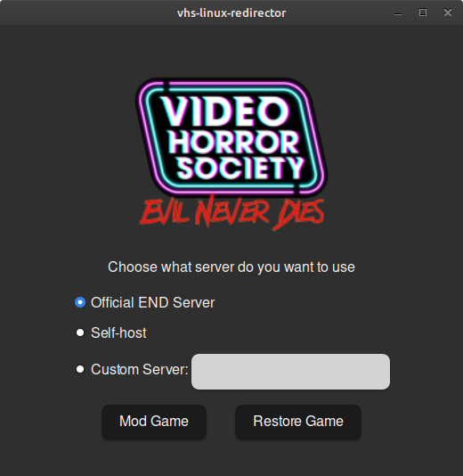
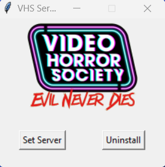

This project is a project intended to restore the game "Video Horror Society" online and offline functionality.

This project consists on different applications to that end.

## VHS Server
A re-implementation of Video Horror Society's API Server. Made in Node. Its GitHub repository also serves as the main source of information for the whole project
- [Source Code](https://github.com/LuisMayo/vhs-alternative-server)

## Patching the game
Currently, we have two known methods of patching the game:

|       Method      | Play With Bots | Multiplayer game |      Supported OSs      | Requires Admin | Installer Link |
|:-----------------:|----------------|------------------|:-----------------------:|----------------|---------------|
| Hosts Redirection |        ✅       |         ✅        |         Windows         |        ✅       | [VHS Redirector Scripts](https://github.com/SkelXton/VHS-Redirector-Scripts/releases/latest) |
| Executable Patching      |        ✅       | 🟡 (Only in Linux/Proton) | Windows; Linux (Proton) |        ❌       | [VHS Server Patcher](https://github.com/LuisMayo/vhs-server-patcher/releases/latest) |

### VHS Patcher

An small Tauri (Rust + Webview) application that finds the VHS executable and modifies it to connect to a different Server Address

### VHS Redirector

This one is made by SkelXton and it follows a different approach for patching the game. Instead of patching the binary, it uses hosts file redirection and a custom certificate to achieve its goal.